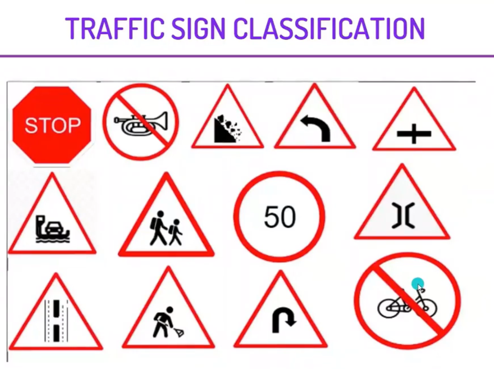

  
 

<i>
  <h2> <i> Traffic Sign Classification </i> </h2>

<i>In this project, we will use a Convolutional Neural Network to build train, and test a traffic sign classification model. We will build this model using TensorFlow and Keras. It is a multiclass classification problem. This model can be used to make smarter cars.

After this project, you will be able to create a MultiClass Classification model using Deep Learning.

 
  

  <h2> The Steps to solve the problem </h2>

1. FINDING DATA ON KAGGLE AND LOADING IT INTO COLLAB.  
2. PREPROCESSING THE IMAGES AND VISUALIZING THEM.  
3. FINDING OUT THE MEAN OF THE DIMENSIONS AND RESIZING ALL IMAGES ACCORDINGLY.  
4. CONVERTING THE IMAGES INTO A NUMPY ARRAY AND NORMALIZE THEM.  
5. CHECKING CLASS IMBALANCE.  
8. SPLITTING THE DATA AND PERFORMING ONE HOT ENCODING.  
7. CREATING THE MODEL ARCHITECTURE, COMPILING THE MODEL AND THEN FITTING IT.  
8. PLOTTING THE ACCURACY AND LOSS AGAINST EACH EPOCH.  
9. PREPROCESSING THE TEST DATA AND MAKE PREDICTIONS ON IT.  
10. VISUALIZING THE ORIGINAL AND PREDICTED LABELS FOR THE TEST IMAGES. 

  
  

<i>This model can be used in self driving cars which will enable them to automatically recognize traffic signs similarly the driver alert system inside cars will help and protect drivers by understanding the traffic signs around them. 

     
  
 
  

### Give It a Star if you liked the project 
